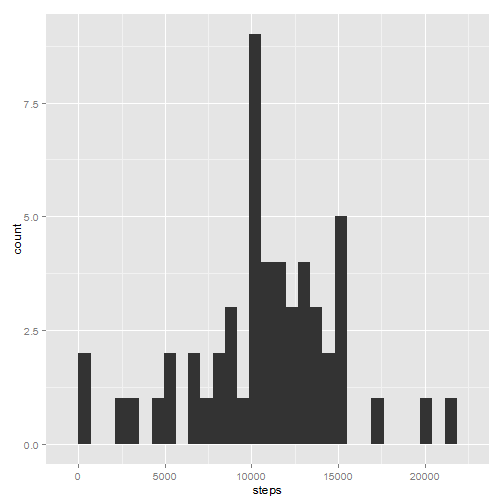
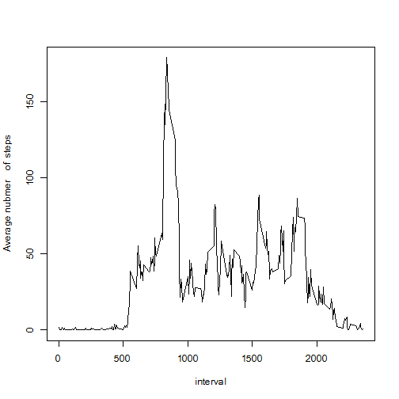
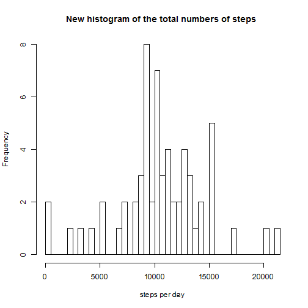
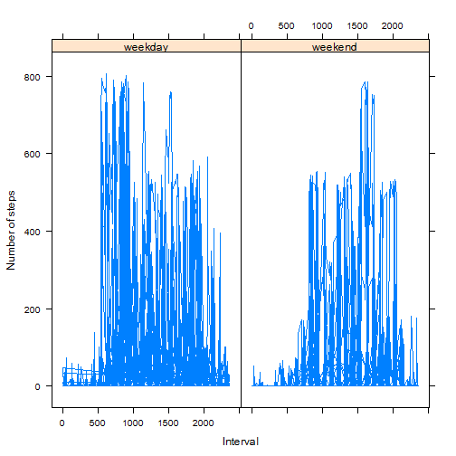

# Reproducible Research: Peer Assessment 1
 
 ```r
  opts_chunk$set(echo=TRUE)
 ```

## Loading and preprocessing the data
 
 ```r
  file<-read.csv("activity.csv", colClasses = c("numeric", "Date", "numeric"))
 head(file)
 ```
 
 ```
 ##   steps       date interval
 ## 1    NA 2012-10-01        0
 ## 2    NA 2012-10-01        5
 ## 3    NA 2012-10-01       10
 ## 4    NA 2012-10-01       15
 ## 5    NA 2012-10-01       20
 ## 6    NA 2012-10-01       25
 ```
## What is mean total number of steps taken per day?
 
 ```r
 file2<-file[complete.cases(file),]
 library(data.table)
 library(ggplot2)
 dt<-data.table(file2)
 per_day<-dt[, sum(steps), by="date"]
 ggplot(per_day, aes(x=V1)) + geom_histogram()+xlab("steps")
 ```
 
 ```
 ## stat_bin: binwidth defaulted to range/30. Use 'binwidth = x' to adjust this.
 ```
 
  
 
 ```r
 meanval<-mean(per_day$V1)
 medval<-median(per_day$V1)
 ```
 
The mean value of total number steps taken per day is 1.0766 &times; 10<sup>4</sup>.

The median value of total number steps taken per day is 1.0765 &times; 10<sup>4</sup>.
## What is the average daily activity pattern?
 
 ```r
 library(data.table)
 dt<-data.table(file2)
 
 per_step<-dt[, sum(steps)/61, by="interval"] 
 plot(per_step$interval,per_step$V1,type="l",xlab="interval",ylab="Average nubmer    of  steps")
 ```
 
  
 
 ```r
 max_interval<-per_step[order(per_step$V1,decreasing=T),][1]
 ```
  5-minut interval   with maximum average across all the days is 835, 179.1311

## Imputing missing values
 
 ```r
  sumNA<-sapply(file, function(x) sum(is.na(x)))
  allNA<-sumNA[1]+sumNA[2]+sumNA[3]
  allNA
 ```
 
 ```
 ## steps 
 ##  2304
 ```
 
 ```r
  dtNA<-file[is.na(file),]
  head(dtNA)
 ```
 
 ```
 ##   steps       date interval
 ## 1    NA 2012-10-01        0
 ## 2    NA 2012-10-01        5
 ## 3    NA 2012-10-01       10
 ## 4    NA 2012-10-01       15
 ## 5    NA 2012-10-01       20
 ## 6    NA 2012-10-01       25
 ```
 
 ```r
  head(per_step)
 ```
 
 ```
 ##    interval      V1
 ## 1:        0 1.49180
 ## 2:        5 0.29508
 ## 3:       10 0.11475
 ## 4:       15 0.13115
 ## 5:       20 0.06557
 ## 6:       25 1.81967
 ```
 
 ```r
  new<-merge(dtNA,per_step)
  new$steps<-new$V1
  new$V1<-NULL
  dt<-data.table(file2)
  dt<-rbind(dt,new,use.names=TRUE)
  dt2<-dt
  head(dt2)
 ```
 
 ```
 ##    steps       date interval
 ## 1:     0 2012-10-02        0
 ## 2:     0 2012-10-02        5
 ## 3:     0 2012-10-02       10
 ## 4:     0 2012-10-02       15
 ## 5:     0 2012-10-02       20
 ## 6:     0 2012-10-02       25
 ```
 
 ```r
  new_per_day<-dt[, sum(steps), by="date"]
  hist(new_per_day$V1,n=61,main = "New histogram of the total numbers of steps ", xlab      ="steps per day")
 ```
 
  
 
 ```r
  newmeanval<-mean(new_per_day$V1) 
  newmedval<-median(new_per_day$V1)
 ```
 New mean value of total number steps taken per day is 1.0581 &times; 10<sup>4</sup>.

 New median value of total number steps taken per day is 1.0395 &times; 10<sup>4</sup>.

This values differs from previous. Inputing missing values impact is very strong.
## Are there differences in activity patterns between weekdays and weekends?

```r
dateDF<- transform(dt2, weekend=as.POSIXlt(date, format='%Y/%m/%d')$wday %in% c(0, 6))
dateDF$dayOfWeek <- "weekday"
dateDF[dateDF$weekend==TRUE,"dayOfWeek"]<-"weekend"

dateDF$dayOfWeek <-as.factor(dateDF$dayOfWeek)
library(lattice)
xyplot(dateDF$steps~dateDF$interval|dateDF$dayOfWeek, type='l',           
   ylab="Number of steps", xlab="Interval")
```

 
